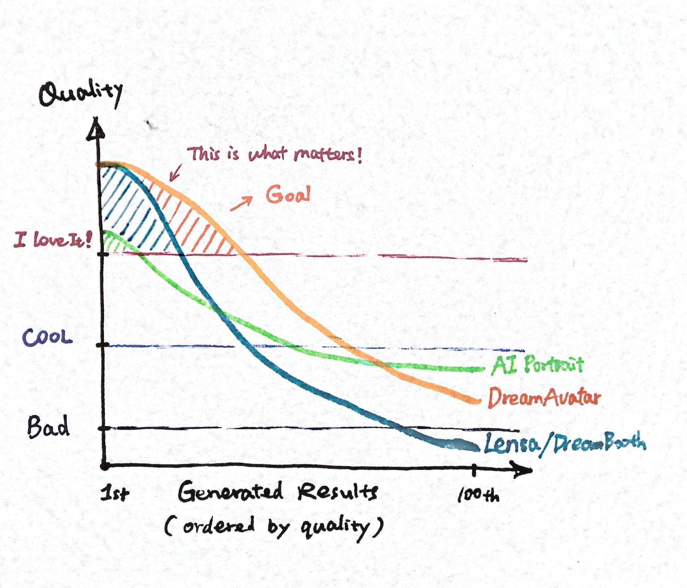

Back in the early days when DreamBooth first came out, I was so excited. Even though the quality wasn't always amazing, but when the model got it right, it was like magic. Watching Lensa's success, I had the insight to myself (now sharing here :)

- It's OK to generate BAD results, as long as you also generate AWESOME results.
- People are willing to wait & pay for PREMIUM content.
- Training happens once, Inferences happen many many many times.

To be continued ...
